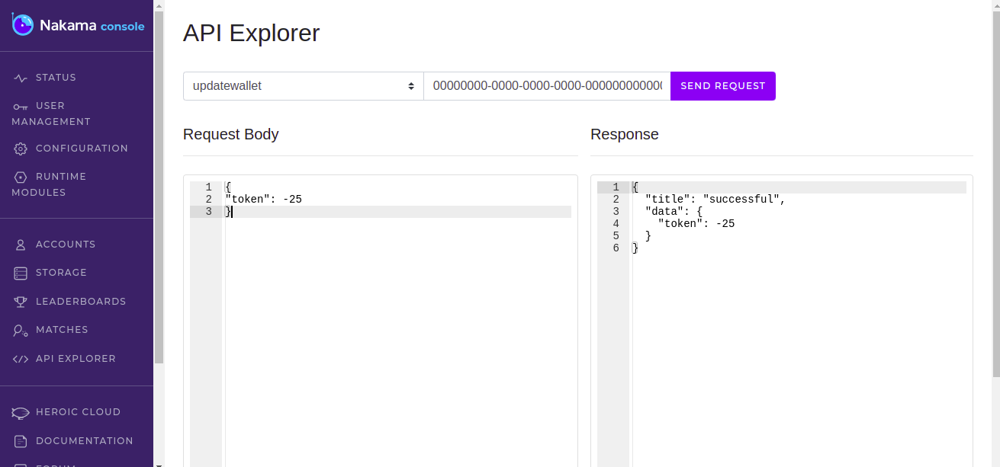

# Nakama RPC

This is a script for generating Remote Procedure Calls in nakama. 

> This project was inspired by my need to update wallet details in nakama.
> The wallet can only be updated using RPC calls which can be triggered by the client.
> You can work with the RPC calls using the nakama api explorer


### Current RPC functions available
- Wallet
- Health Check


### Wallet RPC
The source code for this function is found in `backend/walletupdate.ts`. Feel free to edit it as you wish. 
#### Note:
while editing the wallet RPC note that the `changeset` contains data that would be sent to the wallet data storage.
The current file uses a **token** for wallet data

#### using wallet in API Expolorer
1. find the walletupdate function in the api explorer
2. Paste the user id in the 'user id request form'
3. add the payload
    ```
    {
    "token": -25
    }
    ```
4. Click on the **send request** button
5. on sucessful update of the wallet it returns
    ```
    {
    "title": "successful",
    "data": {
        "token": -25
    }
    }
    ```
6. you have sucessfully updated your wallet token


### Health Check RPC
This is a sample RPC created by [Heroic Labs](https://www.youtube.com/watch?v=Ru3RZ6LkJEk). This is a simple RPC that does not take any input, but returns a json on sucessful implementation. The sucess message is shown below

```
{
  "success": true
}
```
You can update the healthcheck code and it can be found in `backend/healthcheck.ts`.
#### using wallet in API Expolorer
1. find the healthcheck function in the api explorer
2. Paste the user id in the 'user id request form'
3. Click on the **send request** button
4. the successful message is shown on the screen

### Screenshots
